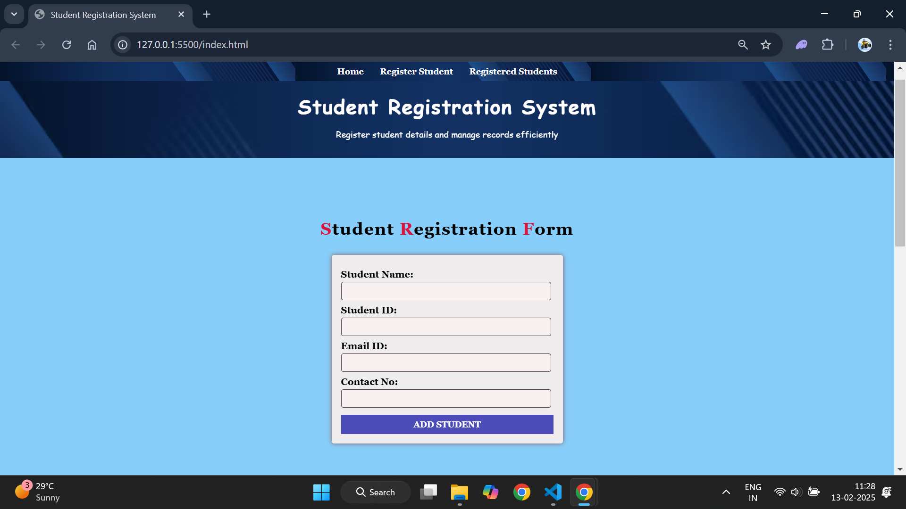
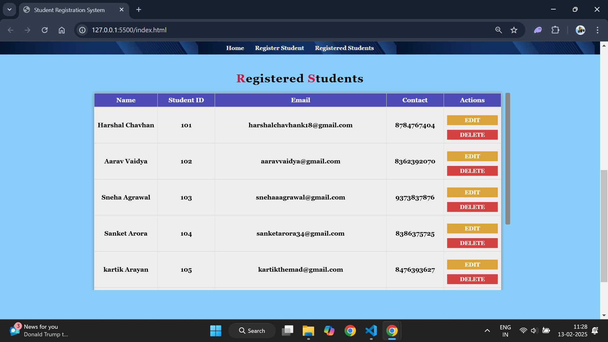

# 🏫 Student Registration System

## 📖 Overview
The **Student Registration System** is a web-based project that enables users to efficiently register, manage, and track student records. It includes features such as adding new records, editing existing records, deleting records, and persistent data storage using local storage.

---

## 🚀 Features
- **Student Registration**: Add student details including Name, Student ID, Email ID, and Contact Number.
- **Edit & Delete Records**: Users can modify or remove student entries directly from the table.
- **Persistent Data**: All records are saved in local storage, ensuring data is retained even after page refresh.
- **Input Validation**: Ensures valid inputs for all fields:
  - **Student ID & Contact No.** – Accepts only numbers.
  - **Name** – Accepts only characters.
  - **Email** – Ensures valid email format.
- **Navigation Bar**: Easily navigate between "Home," "Register Student," and "Registered Students" sections.
- **Dynamic Table with Scrollbar**: The registered student table has a permanent vertical scrollbar and fixed header for better navigation.
- **Responsive UI**: Styled for enhanced readability with proper spacing, font sizes, and a background image.
- **Footer**: Includes a professional footer at the bottom of the page.

---

## 📂 Project Structure
```
📁 Student-Registration-System/  
 ├── 📄 index.html        # Main HTML file  
 ├── 🎨 styles.css        # CSS for styling the project  
 ├── ⚙️ script.js         # JavaScript for dynamic functionality  
 ├── 🖼️ assets/          # Folder for images and background  
 ├── 📄 README.md         # Project documentation  
```

---

## 🛠️ Technologies Used
- **HTML5**: Structure and layout
- **CSS3**: Styling and design
- **JavaScript**: Logic for data handling and local storage

---

## 📜 How to Run the Project
1. **Clone or download** the repository from [GitHub](https://github.com/harshal1800/dom-js-ass.git).
2. Open `index.html` in any web browser.
3. Start registering students, editing records, and managing data! 🎉

---

## 📸 Screenshots
      ## 📸 Screenshots  

### 1. Student Registration Form  
      
      

 ## 📸 Screen recording 
    <video controls src="sr1.mp4" title="screen recoding"></video>

## 📝 Author
Developed by **Harshal Chavhan**

---

## 🤝 Contributions
Contributions are welcome! Fork this repository, make changes, and submit a pull request for review.

---

## 📧 Contact
For any questions or suggestions, feel free to reach out:
- **Email**: harshalchavhank18@gmail.com

---

## 📃 License
This project is open-source and free to use.

